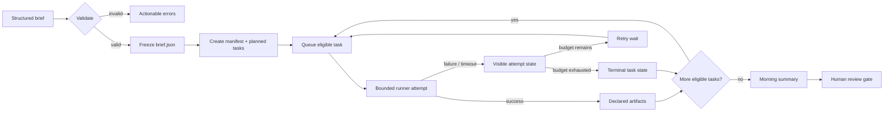
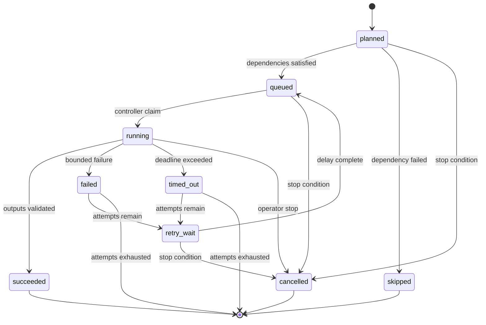
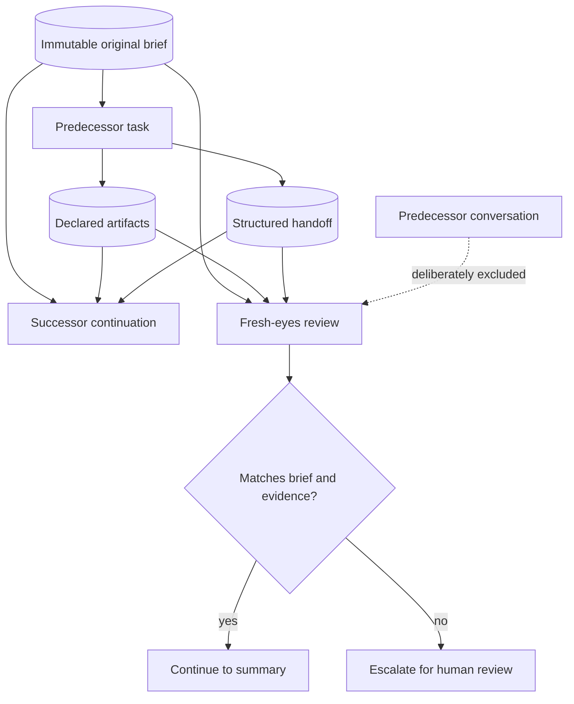
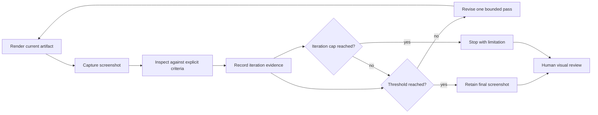

# Architecture and lifecycle diagrams

Nightwatch is a **single-controller local demonstration**, not a distributed workflow engine. The canonical implementation separates deterministic orchestration from the agent transport.

```text
Structured brief → deterministic controller → Runner interface → artifacts/evidence
                                      ├── SyntheticRunner (default, offline)
                                      └── PiJsonRunner (explicit opt-in; not a sandbox)
```

## 1. Brief-to-summary lifecycle



**Readable equivalent:** validation freezes the original brief; each task moves through a visible queue; attempts either produce declared artifacts or visible failure states; the run ends in a summary rather than automatic publication.

## Queue state model



The move between queue directories is atomic on one filesystem. Updating a task file and the aggregate manifest is not a distributed transaction; crash recovery across those two records remains a limitation.

## 2. Heartbeat and recovery

```mermaid
sequenceDiagram
    participant C as Controller
    participant Q as Queue state
    participant R as Runner
    participant H as Heartbeat files
    participant W as Watchdog command

    C->>Q: queued → running
    C->>H: controller heartbeat
    C->>R: execute(task, timeout, stop callback)
    loop bounded attempt
        R->>H: worker heartbeat
        C->>H: controller progress heartbeat
    end
    alt runner succeeds
        R-->>C: declared files + metadata
        C->>Q: running → succeeded
    else runner fails or times out
        R-->>C: typed failure
        C->>Q: running → failed/timed_out
        C->>Q: → retry_wait → queued
    end
    W->>H: inspect component timestamps
    W-->>W: report healthy/stale; never auto-restart
```

The old watcher used one liveness signal while blocking on a child. The packaged controller records separate `controller.json` and `worker.json` heartbeats. The watchdog reports evidence; it does not silently restart work.

## 3. Continuation and fresh-eyes review



A handoff supplements the brief; it never becomes the new source of truth. The fresh-eyes context contains the original brief, declared artifacts, and structured handoff, but no predecessor chat history.

## 4. Screenshot-based creative loop



The committed demonstration generates five local SVG screenshot cards with fixture scores `54 → 66 → 77 → 86 → 92`. The scores test loop control only; they are not aesthetic or user-validation evidence.

## Runtime records

```text
run/
├── brief.json                immutable accepted input
├── manifest.json             aggregate run state
├── events.jsonl              ordered controller events
├── queue/<state>/<task>.json explicit task-state records
├── heartbeats/               controller and worker liveness
├── handoffs/                 structured continuation records
├── workspace/                allowlisted synthetic artifacts
├── STOP                      optional cooperative stop request
└── summary.md                morning review surface
```

## Model routing

Tasks name logical routes such as `analysis`, `implementation`, `review`, or `creative`. The synthetic runner records the route without resolving or calling a model. The optional Pi runner requires each logical route to map to an explicit provider/model pair in portable configuration.

No former machine-specific path or model alias is required by the default run.

## Pi boundary

`PiJsonRunner` uses Pi's structured JSON process mode as a worker transport. Nightwatch remains responsible for task state, attempts, deadlines, handoffs, and evidence. Pi execution requires:

1. `external_services.enabled: true` in configuration;
2. the `--enable-external` CLI flag;
3. an explicit route for the task's provider and model.

Pi runs with the host user's permissions. Allowed-path validation is not a sandbox. Any real Pi-backed task should run inside a disposable workspace or container.

The supervised Windows validation established four transport rules:

- resolve the configured `pi` command through the host `PATH` and launch the npm package's Node CLI directly when possible;
- terminate the complete process tree and stop the run without retry if cleanup cannot be proven;
- require an exact `NIGHTWATCH_TASK_ACK:<task-id>` before accepting a JSON-stream assistant message;
- for fresh reviews, restrict predecessor artifacts to declared dependencies and require sanitized `read` events for every predecessor path.

One acknowledged read-only smoke review succeeded with these rules. A second supervised run then recovered from a deliberate process-tree termination, persisted a handoff, and launched a fresh reviewer that made one validated predecessor-artifact read. Uncontrolled outages, real code changes, and production workloads remain unvalidated.
