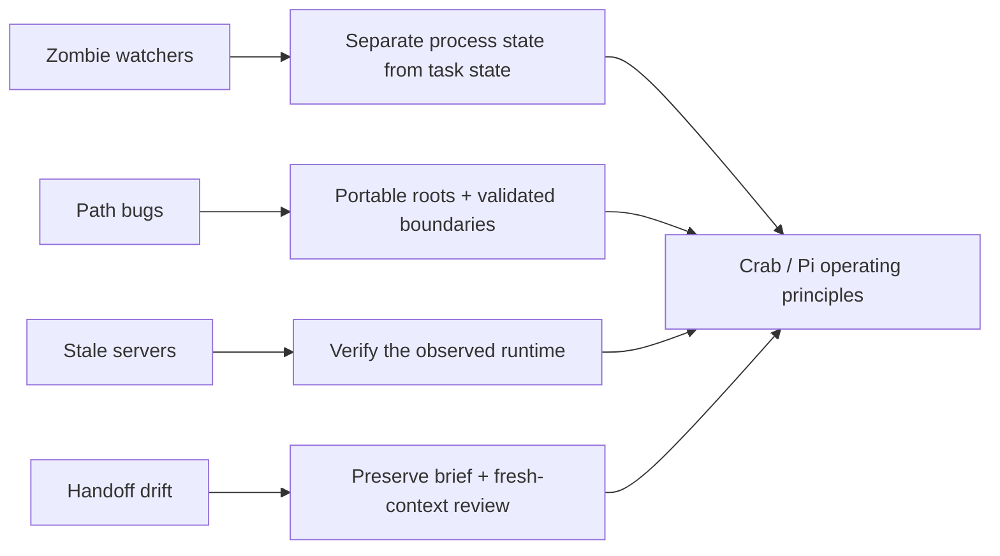

# Failures that shaped Crab

Nightwatch is most useful as evidence of what I learned—not as a claim that the first controller was durable. Four recurring failure classes changed the design direction that followed.

## 1. Zombie watchers

### What failed

A watcher could exist as a process while no longer providing trustworthy supervision. In the migration snapshot, the same loop wrote a so-called orchestrator heartbeat and then blocked waiting for a child process. A long task therefore made the supervisor itself look stale, while a living watcher PID did not prove forward progress.

### Why it mattered

Process existence, supervisor health, worker health, and task progress are different facts. Collapsing them into one heartbeat produced ambiguous recovery decisions and could encourage duplicate restarts.

### Packaged correction

- separate controller and worker heartbeat records;
- typed queue states rather than PID inference;
- explicit runner timeout and stop callbacks;
- watchdog output that reports evidence but never auto-restarts;
- attempt history retained after failure.

### Lesson carried into Crab/Pi

Use harness-native lifecycle events, structured supervision, and human takeover rather than pretending a shell PID is an agent state machine.

## 2. Path bugs

### What failed

The original tooling mixed former machine-specific Windows paths, Git-Bash path assumptions, and string-prefix allowlist checks. A path that merely began with an allowed string could look valid even if it was a sibling directory. Continuation also depended on files whose expected location was not consistently created by start-up code.

### Why it mattered

A wrong workspace can produce apparently valid output in the wrong project. Path correctness is therefore part of product correctness, not setup polish.

### Packaged correction

- every runtime root comes from a CLI argument or relative configuration;
- briefs use normalized forward-slash relative paths;
- component-aware containment replaces string-prefix checks;
- resolved paths are checked again before every write;
- brief, handoff, queue, and output locations are created by one controller;
- no hardcoded former user path remains.

### Lesson carried into Crab/Pi

Make the current workspace and source/destination boundary explicit. Validation should happen at the tool boundary, not only in prose.

## 3. Stale servers

### What failed

Historical creative runs exposed a common visual-agent failure: a screenshot can be internally consistent while coming from an old process, cached asset, or stale development server. The screenshot then reinforces the wrong conclusion instead of correcting it.

This is a reported operational lesson. Raw historical screenshots and private server logs were deliberately excluded from the portfolio.

### Why it mattered

Visual evidence needs provenance: which process, revision, route, and timestamp produced the pixels? “The page loaded” is not enough.

### Packaged correction

The offline demonstration avoids a live application server entirely for its creative loop. Each SVG screenshot card is generated from deterministic fixture state and tied to an ordered event. The case-study site is then smoke-tested separately in a local browser.

### Lesson carried into Crab/Pi

Treat browser state and server readiness as verifiable runtime inputs. Restart deliberately, inspect console/network state, and tie screenshots to the artifact under review.

## 4. Handoff drift

### What failed

Continuation can preserve activity while losing intent. A successor may over-trust the predecessor's summary, inherit a mistaken assumption, or optimize the latest local detail rather than the original objective. The original Nightwatch design recognized fresh-eyes review, but the watcher did not make it a reliable state transition.

### Why it mattered

More context is not always safer context. A long inherited transcript can make the next agent less independent while still omitting the one constraint that matters.

### Packaged correction

- `brief.json` remains immutable;
- continuation requires a schema-valid handoff from a declared dependency;
- the handoff records completed work, next step, artifacts, and risks;
- fresh review receives brief + artifacts + handoff;
- predecessor conversation state is not part of `TaskContext`;
- the manifest records `fresh_context: true` as review evidence.

### Lesson carried into Crab/Pi

Context management is an orchestration primitive. Use explicit handoffs, bounded sessions, fresh reviewers, and compaction/pruning rather than assuming an indefinitely growing conversation remains aligned.

## What these failures do not prove

They do not prove that Nightwatch, Crab, or Pi can autonomously engineer arbitrary software. They show that I identified concrete operating failures, converted them into controller rules, and retained the negative evidence rather than hiding it.

## Next validation gate

The correction claims above are exercised in the synthetic controller and tests. Supervised Pi validation also exposed Windows command-shim resolution, quiet-wrapper supervision, unacknowledged responses, and a non-terminal worker heartbeat label. The accepted two-task run recovered from a deliberate interruption and produced a reviewed handoff; see [`pi-smoke-validation.md`](pi-smoke-validation.md) and [`pi-handoff-validation.md`](pi-handoff-validation.md).
